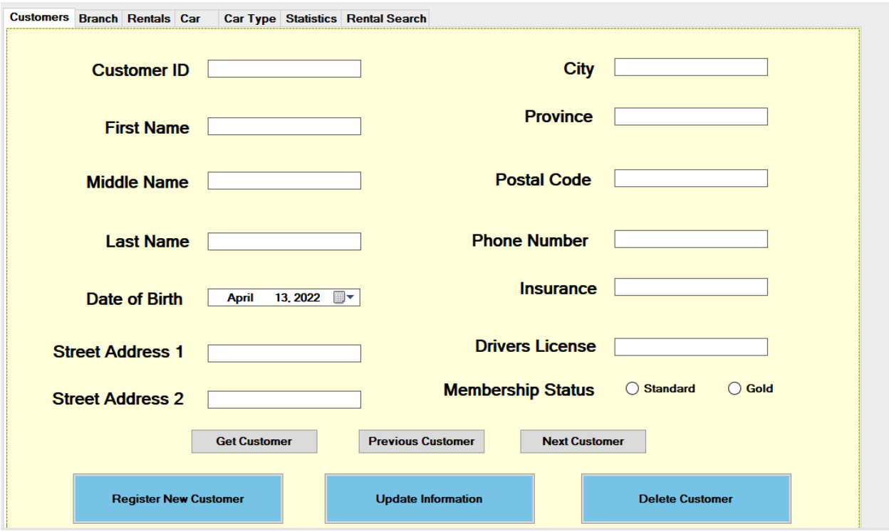
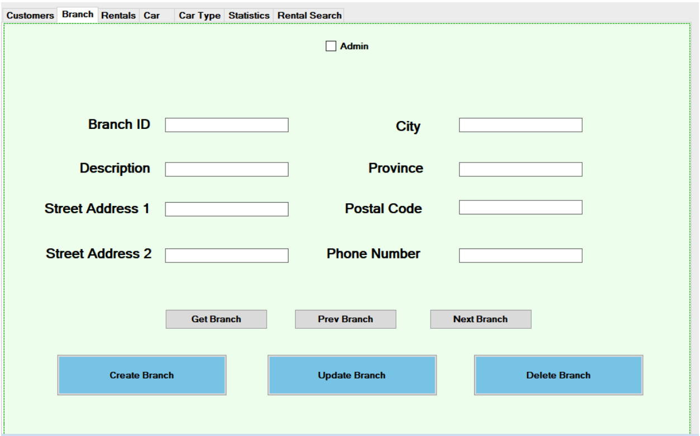
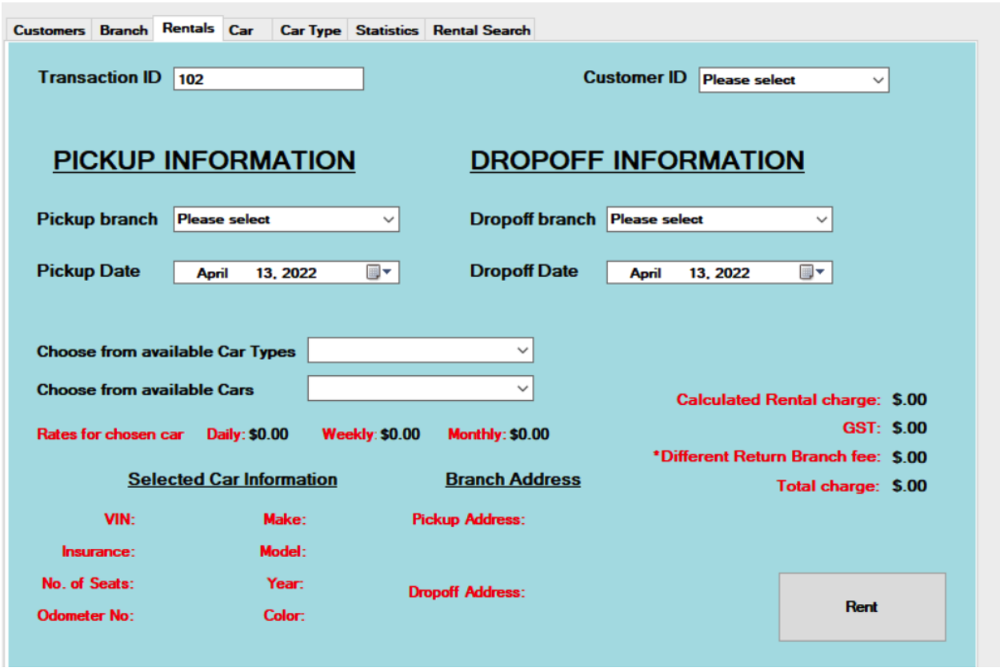
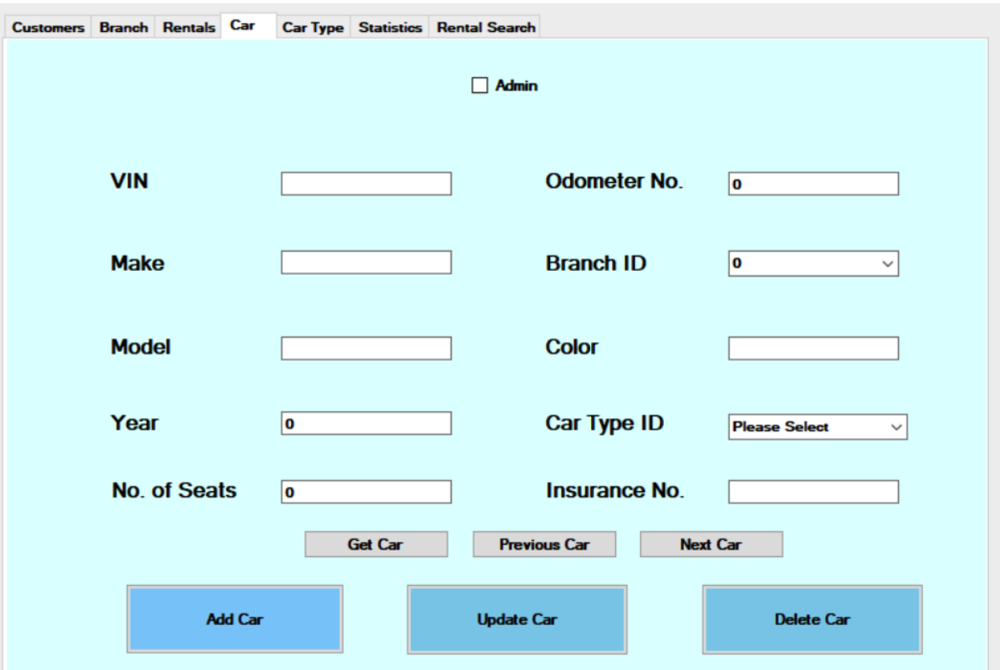
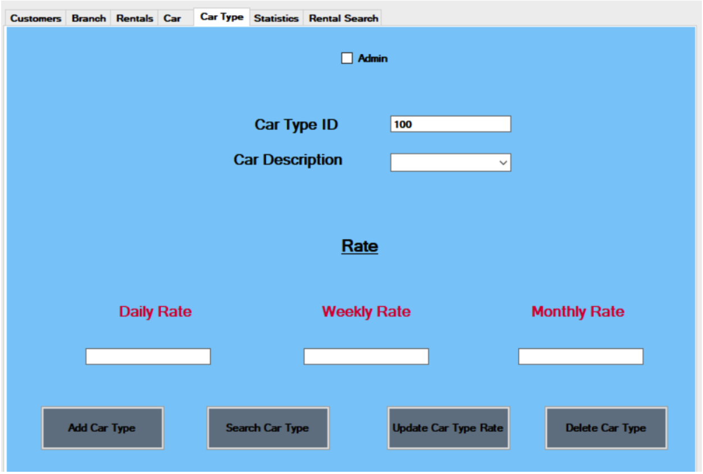
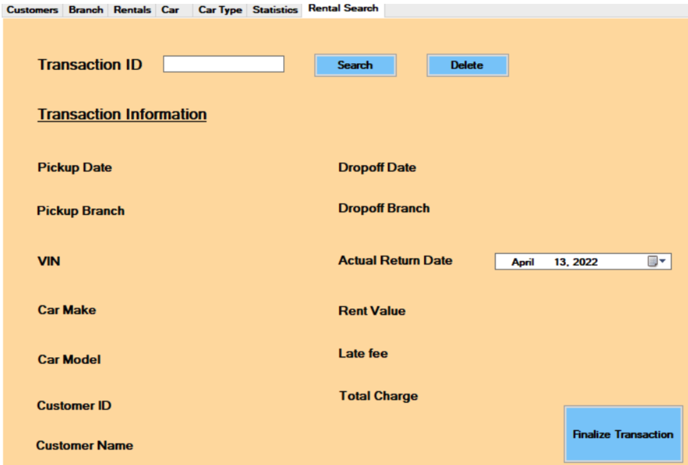
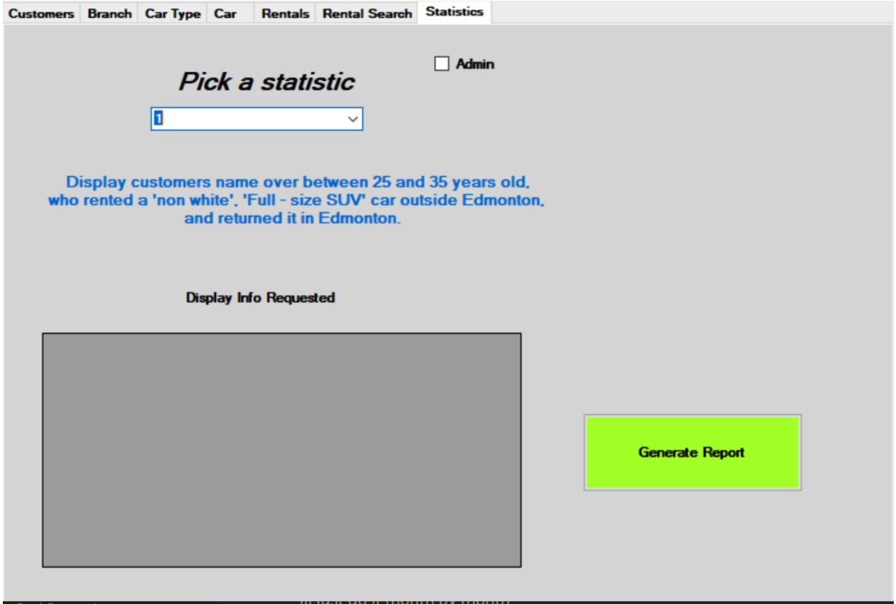

# Car Rental System

This document provides an overview of the Car Rental System application, a software tool designed for car rental agencies to manage customer information, rental transactions, vehicles, and branch operations.

## Features
 - Manage customer information (add, update, delete, search)
 - Manage branch information (add, update, delete, search)
 - Process rental transactions (rent, return, manage fees)
 - Manage vehicle information (add, update, delete, search)
 - Define car types and associated rates
 - View past transaction data

## Navigation

The application is divided into 7 tabs:
- **Customers:** Manage customer information, including personal details, contact information, and rental history.
  
  
  
- **Branches:** Manage branch information, including location details and available car types.
  
  
  
- **Rentals:** Process rental transactions, including selecting vehicles, specifying dates, applying fees, and managing returns.
  
  
  
- **Cars:** Manage vehicle information, including VIN number, car type, branch location, and availability.
  
  

- **Car Types:** Define different car types, associate descriptions, and set daily, weekly, and monthly rental rates.
  
  

- **Rental Search:** Get Details like Car Info, Customer Info, and rental dates by searching the transactions.
  
  

- **Reports:** View reports on past rental transactions, revenue generated, and customer activity.
  
  

## Using the Application

Each tab within the application follows a similar structure:

- **Data Fields:** Input or display information related to the specific tab (e.g., customer details, branch location, car information).
- **Action Buttons:** Perform actions on the data, such as adding, updating, deleting, searching, or renting a car.
- **Additional Information:** Display relevant details like car availability, rental fees, or past transaction history.

Note: More Details can be found in [Usage Guide](Car_rental_UsageGuide.docx.pdf)

## Technology Stack:

- **Programming Language:** C#
- **Development Environment:** Visual Studio
- **Database Management System:** Microsoft SQL Server

## Other Required Software:

- .NET Framework (version compatible with the application)
- SQL Server Management Studio (for database administration, if needed)

## Installation and Setup:

1. Install the .NET Framework and Microsoft SQL Server.
2. Open the project solution in Visual Studio.
3. Configure the database connection string in the app.config file to match your SQL Server instance settings.
4. Build and run the application.

## License
This project is licensed under the MIT License - see the [LICENSE](LICENSE) file for details.
